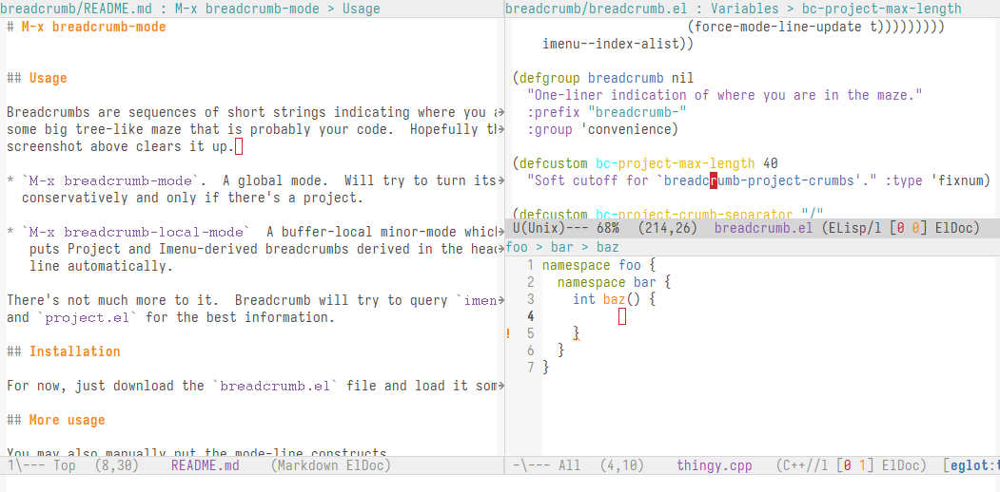

# M-x breadcrumb-mode



## Usage

Breadcrumbs are sequences of short strings indicating where you are in
some big tree-like maze that is probably your code.  Hopefully the
screenshot above clears it up.

* `M-x breadcrumb-mode` is global mode.  Will try to turn itself on
  conservatively and only if there's a project.

* `M-x breadcrumb-local-mode` is a buffer-local minor mode, if you
  don't want the default heuristics for turning it on everywhere.
   
There's not much more to it.  Breadcrumb will try to query `imenu.el`
and `project.el` for the best information.

## Installation

For now, just download the `breadcrumb.el` file and load it somehow.

## More usage

If you want some leet modeline you may also manually put the mode-line
constructs

```lisp
(:eval (breadcrumb-imenu-crumbs))
```

and

```lisp
(:eval (breadcrumb-project-crumbs))
```    

in your settings of the `mode-line-format` or `header-line-format`
variables.

## Tweaks

The shape and size of each breadcrumb groups may be tweaked via
`breadcrumb-imenu-max-length`, `breadcrumb-project-max-length`,
`breadcrumb-imenu-crumb-separator`, and
`breadcrumb-project-crumb-separator`.

The structure each of the breadcrumbs varies depending on whether
either `project.el` and `imenu.el` (or both) can do useful things for
your buffer.

For Project breadcrumbs, this depends on whether `project.el`'s
`project-current` can guess what project the current buffer belongs
to.

For Imenu breadcrumbs, this varies.  Depending on the major-mode
author's taste, the Imenu tree (in variable `imenu--index-alist`) may
have different structure.  Sometimes, minor mode also tweak the Imenu
tree in useful ways.  For example, with recent Eglot (I think Eglot
1.14+), managed buffers get extra region info added to it, which makes
Breadcrumb show "richer" paths.
